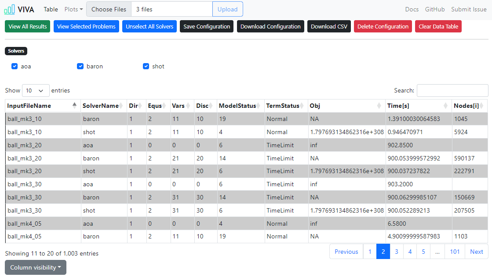

# Data Visualization Project
This is a project in progress for creating a dynamic reporting system, in a HTML format, for SHOT benchmark results. The main goal of this project is to visualize specific results, making it easiier for end users to understand and interpret the benchmarks.

  

---
## Instructions for Using the System
To get started with the project, clone the repository and open the report.html file in a web browser. Select a `solvedata*.txt` file from your computer by clicking the "Browse" button and selecting a file from the file picker that appears.
Once you have selected a file, click on the solvers that you want to see the result for and click on view selection to get the data in a tabular or chart format.

--- 

## Features to Implement
### General
- [ ] Cache the data.
- [ ] Add DocType support.
- [ ] Update the 'Working with codebase' chapter.
- [ ] Add automated UI testing.

### Table Page
- [ ] Check if the number of columns matches with the data.
- [ ] Add option to highlight columns and rows in the table. 
    - [ ] Checkboxes 
    - [x] Sorting by asc/desc
- [x] Clear data after uploading a new file.
- [x] Table.js or other library for tables.

### Plot Page
- [ ] Add support for ustom X/Y values.
- [ ] Add more plotting types. (Selected from navbar -> plots -> type)
- [ ] Fix destruction on Chart.js canvas.

## Working with the Codebase
### 1. Prerequisites

Before getting started, make sure you have the following software installed on your machine:

    Node.js: https://nodejs.org/
    TypeScript: https://www.typescriptlang.org/
    Webpack: https://webpack.js.org/

### 2. Compiling TypeScript to JavaScript
Navigate to the project directory in your terminal.
Run the following command to compile the TypeScript files to JavaScript:

    tsc

This will generate a new directory called build which contains the compiled JavaScript files.

### 3. Bundling JavaScript with Webpack
Make sure you have run the steps to compile the TypeScript files to JavaScript.
Run the following command to bundle the JavaScript files with Webpack:

    npx webpack

This will generate a new file called bundle.js in the build directory.

### 4. Serving the Project
To view the project in a web browser, you can use a simple HTTP server such as http-server.
Install http-server by running the following command:

    npm install -g http-server

Navigate to the build directory and start the HTTP server:

    cd build
    http-server

Open a web browser and navigate to http://localhost:8080 to view the project.